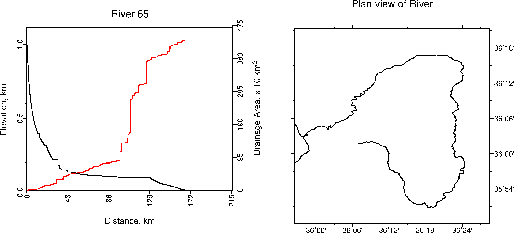

=================
Stream Extraction
=================

------------------------------------------
Extracting Individual Streams for Plotting
------------------------------------------

   Right: River long profile and drainage area 
   Left: Plan view of river profile.

The following example is based on having a list of X Y coordinates for
channel heads of interest. This can be done in two ways, depending on the 
region of interest. To extract all streams in the DEM, the X Y coordinates can
be taken from the starting nodes of the vectorised stream network.

.. code:: bash

   GRASS :~ > v.out.ascii in=stream_300 where="stream_type=start" \
      out=coords.dat format=point layer=-1 separator=',' --o

Alternatively, a randomised set of starting points taken from the 
flow accumulation grid using the same threshold values.

.. code:: bash

   GRASS :~ > r.mapcalc "facc_300 = if( "facc" == 300, 1, null())"
   GRASS :~ > v.out.ascii in=facc_300 out=coords.dat \
      format=point layer=-1 separator=',' --o

Next, convert the flow direction raster into degrees. Flow direction is of 
D8 type with a range of 1 to 8. Multiplying values by 45 gives degrees counter
clockwise from East. 

.. code:: bash

   GRASS :~ > r.mapcalc "fdir_deg = if(fdir != 0, 45. * abs(fdir), null())"

Once we have the coordinates for each of the channel heads in a file, we
run *r.drain* in a loop to create a vector line layer for individual stream 
channels. For our purposes, we want to extract point information along the 
river profile. Using *v.to.point*, points are created along an individual stream 
at a maximum distance no greater than the resolution of the dem. The output 
vector map has 2 layers - layer 2 stores each point as a unique category 
together with the distance from the line’s start stored as *’along’*. 
Use *v.what.rast* to retrieve values for elevation from the dem and 
drainage area pixels from the flow accumulation raster and add those columns 
to the points file. Now the river data is ready for extraction as an ascii file 
for further analysis.

.. code:: bash

   #Setting parameters

   #Determining cell resolution to calculate drainage area (km^2)
   GRASS :~ > eval `g.region -g`
   GRASS :~ > SQ_M=$( echo "${ewres}*${nsres}" | bc -l )
   GRASS :~ > res=$( echo "${nsres}" )
   GRASS :~ > echo "Using resolution: $res and cell area: $SQ_M m^2"

   #Loop to extract river channels
   #Output ascii file contains six columns: 
   #X, Y, cat, length, elev, drainage area (m**2)
   GRASS :~ > i=0
   GRASS :~ > while read X Y; do 
       echo "$X, $Y"
       i=$(( ${i} + 1))
       #Determine individual stream path
       r.drain input=dem direction=fdir_deg output=cpath_$i \
           drain=cpath_$i start_coordinates=$X,$Y --o 
       #Extract X, Y coordinates and distance along channel
       v.to.points input=cpath_$i output=cpath_pnt$i \
           use=vertex dmax=${res} layer=-1 --o
       #Extract elevation at each point
       v.what.rast cpath_pnt$i raster=dem column=elev layer=2 --o
       #Extract flow accumulation at each point
       v.what.rast cpath_pnt$i raster=facc column=accum_pixels layer=2 --o
       v.db.addcolumn cpath_pnt$i columns="accum_area double" layer=2 --o
       #Convert flow accumulation pixels to m^2
       v.db.update cpath_pnt$i column=accum_area \
           query_col="accum_pixels*${SQ_M}" layer=2 --o
       #Drop column with flow accumulation pixels
       v.db.dropcolumn cpath_pnt$i columns="accum_pixels" layer=2 --o
       v.out.ascii -c input=cpath_pnt$i layer=2 columns=* \
           separator=' ' output=riv$i.dat --o
       #Output each stream channel in a separate ascii file
       echo "Created stream: $i"
   done < channel_heads.dat

**Example ASCII file output**

::

   east north cat along elev accum_area
   230061.14327134 3987135.22762934 1 0.00000000 586 5094.56388117
   230061.14327134 3987164.36684656 2 29.13921722 585 221613.52883072
   230032.00405412 3987193.50606378 3 70.34829341 585 236048.12649403
   230002.8648369 3987193.50606378 4 99.48751063 584 252180.91211772
   229973.72561968 3987193.50606378 5 128.62672785 584 253879.10007811
   229944.58640246 3987193.50606378 6 157.76594507 583 257275.47599889
   229915.44718524 3987193.50606378 7 186.90516229 580 258973.66395928
   229886.30796802 3987193.50606378 8 216.04437950 579 393979.60681018
   229857.1687508 3987222.645281 9 257.25345569 579 394828.70079037
   229828.02953358 3987251.78449822 10 298.46253188 577 410961.48641406
   229798.89031636 3987251.78449822 11 327.60174910 573 452567.09144359
   229769.75109914 3987280.92371544 12 368.81082529 570 456812.56134456
   229740.61188192 3987310.06293266 13 410.01990148 557 461907.12522572
   229711.4726647 3987310.06293266 14 439.15911870 553 472945.34696825
   229682.33344748 3987339.20214988 15 480.36819489 545 476341.72288903
   229653.19423027 3987339.20214988 16 509.50741211 537 479738.09880980
   229624.05501305 3987339.20214988 17 538.64662933 529 485681.75667117

The raw river ASCII file will need to be processed before it can be used 
together with the river inversion code.
