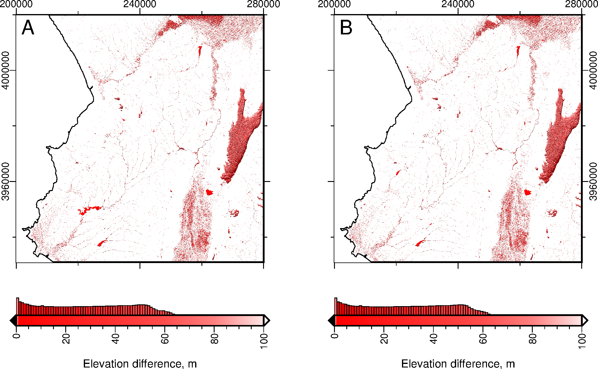

.. _watershed:

==================
Stream Analysis
==================

------------------
Watershed Analysis
------------------

Filling DEM
~~~~~~~~~~~

**To fill or not to fill.** DEM’s will have numerous sinks, 
so before rivers can be extracted, a
hydrologically consistent surface needs to be produced. Local
depressions will interrupt flow-routing alogorithms and produce
incorrect stream networks if incorrect patterns of flow accumulation
have been created. However, it is worth noting that not all sinks are
errors due to resolution of the data or rounding of elevations to the
nearest integer, these sinks can be real-life features. GRASS
*r.watershed* module does not require DEM’s to be filled. Instead it
uses a least-cost search A* algorithm to traverse the elevation surface from
the outlet. Whether you decide to fill your DEM before processing, will
depend on what aspects you are exploring. 

.. figure:: images/flat_artefacts.png
   :alt: Flat artefacts

   Stream Flat Artefacts. (A) GRASS Stream network extracted from an unfilled dem. (B) GRASS stream network using filled DEM. (C) ArcGIS stream network using filled dem.

Filling with GRASS
~~~~~~~~~~~~~~~~~~

GRASS *r.fill.dir* module fills DEM’s in the same way as ArcGIS’s Fill
tool (available as part of ArcGIS’s spatial analyst licence). GRASS follows
Henson and Domingue (1998) to filter and fill the elevation map. Using
the neighborhood technique, *r.fill.dir* fills depressions with
one pass across the elevation model and to produce a flow direction map by
assigning flow direction towards the steepest slope from one of the 8 surrounding cells (D8 algorithm). In flat areas, where cells in a number of
different directions have the steepest slope, the algorithm will iteratively try different routes by propogating flow directions from areas where directions are know into areas that can’t be resolved. If *r.fill.dir* is unable to fill problem areas on first pass, run *r.fill.dir* repeatedly (using output from one run as input to the next run)  to fill all problem areas. Be aware that these depression-filling algorithms  create artifical features (e.g. flats leading to parallel streams).

.. code:: bash

   #Sets computational region
   GRASS :~ > g.region raster=dem -p
   #Fills dem
   GRASS :~ > r.fill.dir input=dem output=dem_fill direction=fdir \
       areas=dem_sinks

   Difference map comparing filled vs unfilled dem for 
   (A) ArcGIS fill tool and (B) GRASS *r.fill.dir* tool.

Use raster calculator to generate a difference map showing pixelwise
differences between the raw and filled dem:

.. code:: bash

   # Create diff map
   GRASS :~ > r.mapcalc "dem_diff = dem_fill - dem"
   GRASS :~ > r.colors dem_diff color=differences

   # assess univariate statistics of differences
   GRASS :~ > r.univar -e dem_diff

   # vectorize filled areas (see r.univar output, 
   # fills are positive values)
   GRASS :~ > r.mapcalc "dem_fill_area = if(dem_diff > 0.0, 1, null() )"
   GRASS :~ > r.to.vect input=dem_fill_area output=dem_fill_area type=area

   # visualise differences using hillshade
   GRASS :~ > r.relief input=dem_fill output=dem_fill_shade
   GRASS :~ > d.mon wx0
   GRASS :~ > d.shade shade=dem_fill_shade color=dem_fill
   GRASS :~ > d.vect dem_fill_area type=boundary color=red

Large Datasets: Using Python Richdem
~~~~~~~~~~~~~~~~~~~~~~~~~~~~~~~~~~~~~

Grass’s *r.fill.dir* module does not cope well with large raster datasets. It is worth exploring python modules like *Richdem* created by
Richard Barnes from Berkeley to fill DEMs before importing into GRASS. Below is an example using Richdem in python to fill the DEM and compare output with the unfilled DEM. 

.. code:: python

   >>> import richdem as rd

   >>> input="dem.tif"
   >>> output="dem_filled.tif"

   #Load DEM
   >>> dem = rd.LoadGDAL(input)

   #Copy the DEM if intending to create diff map
   #Skip this step if not interested in comparing DEMs
   >>> demorig = dem.copy()

   #Fill depressions in the DEM. The data is modified in-place 
   #to avoid making an unnecessary copy. This saves both time and RAM
   >>> rd.FillDepressions(dem, epsilon=False, in_place=True)

   #Compare difference of the filled and unfilled DEM
   >>> diff = dem - demorig

   #Display the difference. 
   #Do not plot values where there was no difference.
   #Note: none of the *rd.rdShow* modules worked for me
   #but can be easily plotted up in GMT as in the figure above
   >>> rd.rdShow(diff, ignore_colours=[0])

   #Save the DEM
   >>> rd.SaveGDAL(output, dem)

-------------------------
Extracting Stream Network
-------------------------

Flow Accumulation
~~~~~~~~~~~~~~~~~

Flow accumulation can be generated using the GRASS module *r.watershed*.
Ths is based on the least cost path (LCP) algorithm by Hart et al., 1968 
and Ehlschlaeger, 1989 originally designed to increase processing speed
and reduce memory use. Outlets, or pour points, are the lowest point along
the map boundary where at least one neighbouring cell has unknown elevation
(i.e. masked coastlines). Instead of using the path of steepest descent, the 
search proceeds along the least steep uphill slope from a pour point sorted 
on cost (i.e. lowest elevation). If a sink is encountered, the search will take
the steepest descent to the bottom of the depression and then continue uphill as before. The search continues until all grid points have been processed. 

The flow accumulation raster can be created using *r.watershed* with the 
option of using single flow direction (*-s* flag) or multiple flow direction
(*-m* flag).

.. table:: 
   
   +---------+-----------------------------+
   | Inputs: | Filled dem                  |
   +---------+-----------------------------+
   | Output: | Flow accumulation raster    |
   +---------+-----------------------------+

.. code:: bash

   GRASS :~ > r.watershed -s ele=dem acc=facc

Flow Direction and Stream Network
~~~~~~~~~~~~~~~~~~~~~~~~~~~~~~~~~~

The GRASS module *r.stream.extract* will output both a flow direction raster and stream network. Note that both modules *r.stream.extract* and *r.watershed* produce slightly different vector layers, so use *r.stream.extract* to create the vectorised stream network.

.. table::

   +-----------+--------------------------------------------------------+
   | Inputs    | filled dem, flow accumulation raster                   |
   +-----------+--------------------------------------------------------+
   | Threshold | min flow accumulation to initiate streams              |
   +-----------+--------------------------------------------------------+
   | Outputs   | flow direction, stream network raster and vector layer |
   +-----------+--------------------------------------------------------+

The threshold will determine the river network density. You will need to play around with this number and check the fidelity of stream network with Landsat and/or satellite imagery. For example, a threshold of 300 will extract streams with a minimum drainage area of 0.27 km :sup:`2` for a 30 m dem or 2.43 km :sup:`2` for a 90 m dem.

.. code:: bash

   GRASS :~ > r.stream.extract elevation=dem accumulation=facc \
       threshold=300 stream_rast=stream \
       stream_vector=stream direction=fdir

Delineating Catchments
~~~~~~~~~~~~~~~~~~~~~~

.. image:: images/sub_basin.png
   :width: 48%
              
.. image:: images/basin.png
   :width: 48%

*Sub-catchments extracted using r.watershed v. main watershed extracted using r.stream.basins*

While *r.watershed* outputs a basins raster, the resulting basin raster identifies
all sub-catchments. Use the *-l* flag in the *r.stream.basins* module
to identify main watersheds in the DEM of interest.

.. code:: bash

   GRASS :~ > r.stream.basins -l direction=fdir stream_rast=stream \
       basins=basin

Incomplete Basins
~~~~~~~~~~~~~~~~~

Incomplete basins will underestimate flow accumulation which can be a problem where the regional extent of the dem truncates complete catchment areas. The flow accumulation raster will identify these areas with negative values and problem areas can be identified using  the raster calculator. If these incomplete basins are problematic for subsequent analysis, expand the region of interest and re-create the rasters following the steps above. 

Inputs required:  Filled dem, basin

.. code:: bash

   #To identify parts of the basin likely to underestimate 
   #flow accumulation
   GRASS :~ > r.mapcalc "problems = if(facc < 0, basin, null())" 

Exporting Vectors
~~~~~~~~~~~~~~~~~

Export vector layers using the *v.out.ogr* module. This tool allows you to specify any number of different output formats. This code example uses *GMT*. Remember for stream networks, make sure to specify that the type=line.
Areas seem to be automatically picked up with no complaints by GMT when
it comes to plotting.

.. code:: bash

   GRASS 7.6.0 :~ > v.out.ogr input=vector_file output=vector_file.shp \
       format="OGR_GMT"
